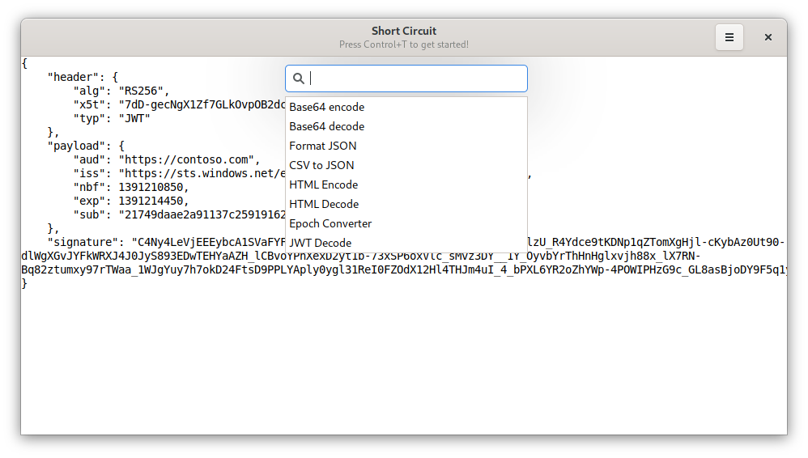

# Short Circuit

A developer scratchpad built for GNOME.

## Install

## Screenshot

## What does it do?

If you have ever found yourself copy pasting stuff into the browser or in VS Code for

- Converting base64 to string
- Formatting JSON
- Encoding URL components etc..

Then Instead of going around copy pasting your company's secrets, you can now open a native
linux app which takes care of all this for you!

Just open short-circuit, paste the text, select the transformer and you are good to go!

### Credits
- This app was inspired by [Boop](https://boop.okat.best/), since it does not exist for linux. I 
    thought it would be a good learning experience for me to make this in GTK/python.
- Thanks to Bilal for helping me out over at #gnome when I was stuck.

